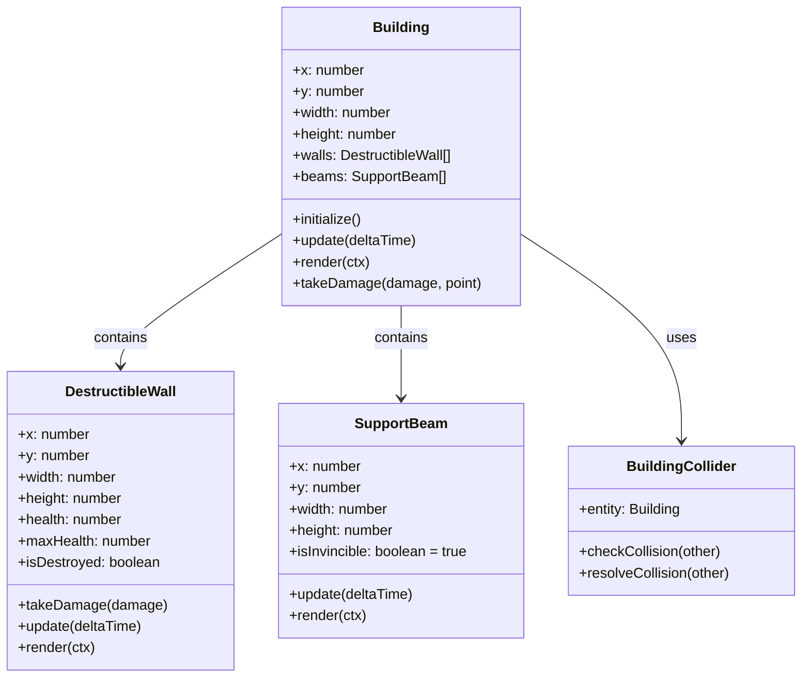

# Building Structure Design

## Overview

This document outlines the design for destructible building walls with invincible support beams in the GTA-inspired game. The design follows a component-based architecture that allows for modular building construction with destructible and indestructible elements.

The building system will be implemented with:
- A main `Building` entity that represents the overall structure
- A `DestructibleWall` component for destructible wall segments
- A `SupportBeam` component for invincible structural support elements
- A `BuildingCollider` component for physics collision handling

## Architecture

The building system follows a modular component-based architecture:



## Component Definitions

### Building.js (Main Building Entity)

The main building entity serves as a container for all building components and manages the overall structure.

**Properties:**
- `x`, `y`: Position of the building
- `width`, `height`: Dimensions of the building
- `walls`: Array of DestructibleWall components
- `beams`: Array of SupportBeam components
- `collider`: BuildingCollider component for physics interactions

**Methods:**
- `initialize()`: Sets up the building structure with walls and beams
- `update(deltaTime)`: Updates all building components
- `render(ctx)`: Renders the building and all its components
- `takeDamage(damage, point)`: Distributes damage to appropriate components

### BuildingCollider.js (Physics Collision Component)

Handles all physics interactions for the building.

**Properties:**
- `entity`: Reference to the parent building

**Methods:**
- `checkCollision(other)`: Checks for collisions with other entities
- `resolveCollision(other)`: Resolves collision responses

### DestructibleWall.js (Destructible Wall Component)

Represents destructible wall segments of the building.

**Properties:**
- `x`, `y`: Position of the wall segment
- `width`, `height`: Dimensions of the wall segment
- `health`: Current health of the wall
- `maxHealth`: Maximum health of the wall
- `isDestroyed`: Flag indicating if the wall is destroyed
- `destructionEffect`: Visual effect for destruction

**Methods:**
- `takeDamage(damage)`: Reduces wall health and handles destruction
- `update(deltaTime)`: Updates wall state
- `render(ctx)`: Renders the wall segment

### SupportBeam.js (Invincible Support Beam Component)

Represents invincible structural support elements that maintain building integrity.

**Properties:**
- `x`, `y`: Position of the beam
- `width`, `height`: Dimensions of the beam
- `isInvincible`: Always true for support beams
- `structuralIntegrity`: Strength of the beam (affects building stability)

**Methods:**
- `update(deltaTime)`: Updates beam state
- `render(ctx)`: Renders the beam

## Data Models

### Building Structure

```javascript
class Building {
  constructor(x, y, width, height) {
    this.x = x;
    this.y = y;
    this.width = width;
    this.height = height;
    this.walls = [];
    this.beams = [];
    this.collider = new BuildingCollider(this);
    this.initialize();
  }
}
```

### Wall Segment

```javascript
class DestructibleWall {
  constructor(x, y, width, height) {
    this.x = x;
    this.y = y;
    this.width = width;
    this.height = height;
    this.health = 100;
    this.maxHealth = 100;
    this.isDestroyed = false;
  }
}
```

### Support Beam

```javascript
class SupportBeam {
  constructor(x, y, width, height) {
    this.x = x;
    this.y = y;
    this.width = width;
    this.height = height;
    this.isInvincible = true;
    this.structuralIntegrity = 1000; // Very high value
  }
}
```

## Business Logic

### Damage System

The damage system distributes damage to building components based on hit location:

1. When a building takes damage at a specific point:
   - Determine which component is hit (wall or beam)
   - Apply damage to the appropriate component
   - For walls: reduce health and check for destruction
   - For beams: damage is ignored due to invincibility

2. Wall destruction logic:
   - When wall health reaches zero, mark as destroyed
   - Trigger destruction effects (particles, sound)
   - Update building structure integrity
   - Check if building collapse should occur

3. Building collapse conditions:
   - If critical support beams are adjacent to destroyed walls
   - If more than 50% of walls are destroyed
   - If key structural integrity points are compromised

### Structural Integrity System

The building maintains structural integrity through:

1. Support beams that are completely invincible
2. Wall-to-beam connections that distribute load
3. Collapse triggers when structural integrity falls below threshold

## Integration with Existing Systems

### Physics Integration

Buildings will integrate with the existing physics system through:

1. The `BuildingCollider` component that uses existing collision detection methods
2. Implementation of `checkRectCollision` from the `Physics` class
3. Collision response handling for bullets, vehicles, and player interactions

### Rendering Integration

Buildings will be rendered as part of the city rendering system:

1. Buildings are rendered after roads but before entities
2. Use existing camera and viewport culling systems
3. Implement level-of-detail rendering for distant buildings

### Particle Effects Integration

Destruction effects will utilize the existing particle system:

1. Wall destruction triggers particle effects
2. Support beam damage (if any visual feedback) uses particle effects
3. Building collapse creates large-scale particle effects

## API Endpoints/Methods

### Building Class Methods

| Method | Parameters | Description |
|--------|------------|-------------|
| `initialize()` | None | Sets up building components |
| `update(deltaTime)` | `deltaTime`: Time since last update | Updates all building components |
| `render(ctx)` | `ctx`: Canvas rendering context | Renders the building |
| `takeDamage(damage, point)` | `damage`: Damage amount, `point`: Impact point | Distributes damage to components |
| `checkIntegrity()` | None | Checks if building should collapse |

### DestructibleWall Methods

| Method | Parameters | Description |
|--------|------------|-------------|
| `takeDamage(damage)` | `damage`: Damage amount | Reduces wall health |
| `update(deltaTime)` | `deltaTime`: Time since last update | Updates wall state |
| `render(ctx)` | `ctx`: Canvas rendering context | Renders the wall |

### SupportBeam Methods

| Method | Parameters | Description |
|--------|------------|-------------|
| `update(deltaTime)` | `deltaTime`: Time since last update | Updates beam state |
| `render(ctx)` | `ctx`: Canvas rendering context | Renders the beam |

## Testing

### Unit Tests

1. **Building Creation Tests**
   - Verify building is created with correct dimensions
   - Verify walls and beams are properly initialized
   - Verify collider is attached

2. **Wall Destruction Tests**
   - Test wall health reduction
   - Test wall destruction when health reaches zero
   - Test that support beams are not affected by damage

3. **Collision Tests**
   - Test building collision detection with player
   - Test building collision detection with vehicles
   - Test building collision detection with bullets

4. **Structural Integrity Tests**
   - Test building collapse conditions
   - Test support beam invincibility
   - Test damage distribution logic

### Integration Tests

1. **Physics Integration Tests**
   - Test that buildings block entity movement
   - Test collision response with different entity types

2. **Rendering Tests**
   - Test that buildings render correctly
   - Test destruction visual effects
   - Test camera culling works with buildings

3. **Performance Tests**
   - Test building update performance with many buildings
   - Test rendering performance with destroyed buildings
   - Test memory usage with building destruction effects