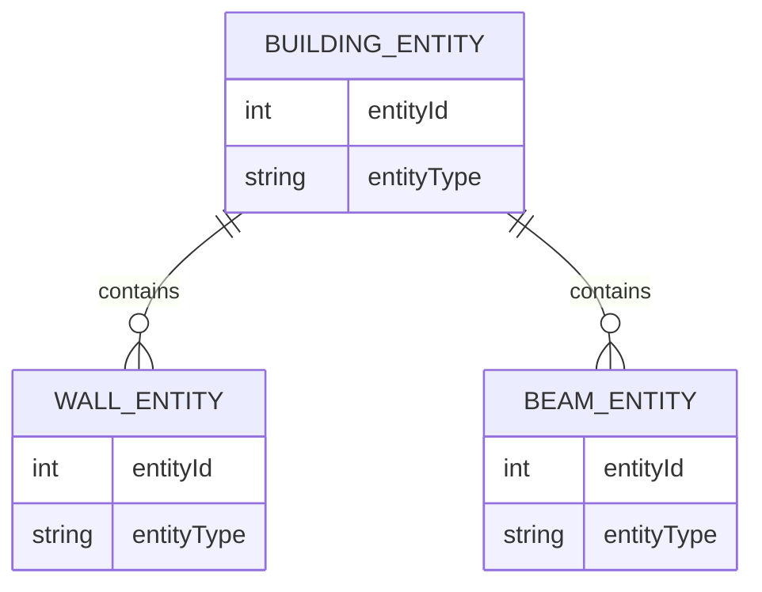

# ECS Structure Implementation for Destructible Buildings

## Overview

This document outlines the implementation of an Entity-Component-System (ECS) architecture for destructible buildings in the GTA-inspired game. The current building system uses a traditional object-oriented approach with inheritance and composition. This design will refactor the system to use ECS principles for better modularity, performance, and extensibility.

The implementation will also add more variety to building spawns and create particle effects when walls are destroyed.

## Architecture

### Current Building System Structure

The current system uses a traditional object-oriented approach:
- `Building` class contains walls and support beams
- `DestructibleWall` and `SupportBeam` are specialized components
- `BuildingCollider` handles physics interactions

### Proposed ECS Architecture

The new ECS architecture will organize the building system into:

```
js/
├── ecs/
│   ├── EntityManager.js
│   ├── Component.js
│   ├── System.js
│   ├── entities/
│   │   └── BuildingEntity.js
│   ├── components/
│   │   ├── PositionComponent.js
│   │   ├── RenderComponent.js
│   │   ├── PhysicsComponent.js
│   │   ├── HealthComponent.js
│   │   ├── DestructibleComponent.js
│   │   ├── SupportComponent.js
│   │   ├── BuildingStructureComponent.js
│   │   └── ParticleEffectComponent.js
│   └── systems/
│       ├── BuildingRenderSystem.js
│       ├── BuildingPhysicsSystem.js
│       ├── DamageSystem.js
│       ├── DestructionSystem.js
│       └── ParticleEffectSystem.js
```

### ECS Framework Implementation

The ECS framework will consist of core classes that manage entities, components, and systems:

#### EntityManager
- Manages entity creation and destruction
- Handles component assignment and retrieval
- Provides querying capabilities for systems

#### Component Base Class
- Defines the base structure for all components
- Implements serialization/deserialization
- Provides component lifecycle methods

#### System Base Class
- Defines the base structure for all systems
- Implements update loop integration
- Provides entity filtering capabilities

### ECS Components

#### PositionComponent
- `x`, `y`: Position coordinates
- `width`, `height`: Dimensions

#### RenderComponent
- `color`: Base color
- `destroyedColor`: Color when destroyed
- `isVisible`: Visibility flag
- `renderOrder`: Rendering order

#### PhysicsComponent
- `collider`: Collision shape
- `isStatic`: Static physics flag
- `mass`: Mass for physics calculations

#### HealthComponent
- `health`: Current health
- `maxHealth`: Maximum health
- `isDestroyed`: Destruction flag

#### DestructibleComponent
- `destructionType`: Type of destruction
- `resistance`: Damage resistance factor
- `dropItems`: Items dropped on destruction

#### SupportComponent
- `supportStrength`: Structural support provided
- `isInvincible`: Invincibility flag
- `structuralRole`: Role in building structure

#### BuildingStructureComponent
- `buildingId`: Reference to parent building
- `structureType`: Type of structural element (wall, beam, etc.)
- `connectedElements`: Adjacent structural elements

#### ParticleEffectComponent
- `effectType`: Type of particle effect
- `effectParams`: Parameters for effect generation
- `isActive`: Effect activation flag

### ECS Systems

#### BuildingRenderSystem
Handles rendering of all building entities and components:
- Processes entities with RenderComponent
- Applies color changes based on HealthComponent
- Renders destruction effects

#### BuildingPhysicsSystem
Manages physics interactions for buildings:
- Processes entities with PhysicsComponent
- Handles collision detection and response
- Updates positions based on physics simulation

#### DamageSystem
Processes damage to building components:
- Processes damage events
- Applies damage to entities with HealthComponent
- Triggers destruction when health reaches zero

#### DestructionSystem
Handles building element destruction:
- Processes entities with DestructibleComponent
- Updates BuildingStructureComponent when elements are destroyed
- Triggers collapse when structural integrity is compromised

#### ParticleEffectSystem
Manages particle effects for destruction:
- Processes entities with ParticleEffectComponent
- Creates particle effects based on destruction events
- Updates and renders particle effects

## Data Models

### Building Entity Composition

A complete building will be composed of multiple entities:
- Main building entity (contains BuildingStructureComponent)
- Wall entities (contain DestructibleComponent, HealthComponent)
- Support beam entities (contain SupportComponent, HealthComponent)
- Decoration entities (optional, contain RenderComponent)

### Component Relationships



## Business Logic

### Building Generation Logic

The new system will enhance building variety through:

1. **Building Types**:
   - Residential buildings (2-4 stories)
   - Commercial buildings (1-2 stories, wider)
   - Industrial buildings (1 story, large footprint)
   - Skyscrapers (5+ stories)

2. **Architectural Styles**:
   - Modern (clean lines, glass facades)
   - Classic (brick, ornate details)
   - Industrial (steel, concrete)
   - Mixed (combination of styles)

3. **Structural Variations**:
   - Different wall configurations
   - Variable support beam placement
   - Unique window patterns

### Building Variety Implementation

The building variety will be implemented through:

#### Procedural Generation System
- Building type selection based on district and location
- Architectural style assignment with weighted probabilities
- Structural variation algorithms for unique appearances

#### Component-Based Design
- Different RenderComponent configurations for each style
- Variable PositionComponent arrangements for structural variations
- Specialized BuildingStructureComponent for different building types

#### District Integration
- City districts will influence building type probabilities
- Adjacent buildings will have complementary styles
- Height restrictions based on district regulations

### Damage and Destruction Logic

1. **Damage Distribution**:
   - Damage applied to HealthComponent of hit entity
   - Visual feedback through RenderComponent color changes
   - Support beams resist damage through SupportComponent

2. **Destruction Effects**:
   - Wall destruction triggers ParticleEffectComponent
   - Support beam damage creates spark effects
   - Building collapse creates large explosion effects

3. **Structural Integrity**:
   - BuildingStructureComponent tracks connections
   - DestructionSystem evaluates structural impact
   - Progressive collapse based on support loss

### Particle Effects Logic

1. **Wall Destruction**:
   - Concrete chunks (3-8 particles)
   - Dust clouds (5-15 particles)
   - Duration: 1-3 seconds

2. **Support Beam Impact**:
   - Sparks (5-10 particles)
   - Glowing fragments (3-5 particles)
   - Duration: 0.5-1 second

3. **Building Collapse**:
   - Large explosion (20-30 particles)
   - Debris field (15-25 particles)
   - Smoke clouds (10-20 particles)
   - Duration: 3-5 seconds

### Particle Effect Implementation

The particle effects will leverage the existing particle system with new specialized particle types:

#### ConcreteChunkParticle
- Extends existing Particle class
- Implements realistic physics with gravity and bouncing
- Uses brown/gray color palette

#### DustParticle
- Lightweight particles with floating behavior
- Gradual fade-out effect
- Gray/white color palette

#### SparkParticle
- High-energy particles with bright colors
- Short lifespan with intense glow
- Yellow/white color palette

All particle effects will utilize the existing object pooling system for optimal performance.

## API Design

### Entity Creation

Building entities will be created through the EntityManager with appropriate components attached based on their type and function.

### Damage Application

The DamageSystem will process damage events and apply them to the HealthComponent of affected entities, triggering destruction when health reaches zero.

### Effect Triggering

The ParticleEffectSystem will create visual effects based on destruction events, leveraging the existing particle system with new specialized particle types.

### System Integration

All building systems will integrate with the main game loop and existing systems through the EntityManager and component queries.

## Integration Points

### Game Engine Integration

The ECS building system will integrate with the existing game engine through:
- EntityManager integration with existing object management
- Rendering system integration with LOD and viewport culling
- Physics system integration with collision detection
- Particle system extension with new effect types

### City Generation Integration

The city generation system will be modified to:
- Create ECS building entities instead of traditional objects
- Implement building variety through component variations
- Optimize performance through entity pooling and spatial partitioning

## Testing Strategy

### Unit Tests

Testing will cover:
- Component initialization and state changes
- System functionality for damage application and effects
- Integration with existing game systems

### Test Scenarios

Key scenarios to test:
- Single wall destruction with particle effects
- Complete building collapse with structural integrity
- Performance with multiple buildings and simultaneous damage
- Edge cases such as boundary destruction and collision accuracy

## Implementation Plan

### Phase 1: ECS Core Implementation
- Create ECS framework with EntityManager, Component base class, and System base class
- Implement basic components and core systems
- Set up entity pooling mechanism

### Phase 2: Building System Integration
- Refactor existing building classes to ECS components
- Implement building generation with ECS entities
- Add structural integrity system and integrate with City class

### Phase 3: Enhanced Features
- Implement building variety system with different types and styles
- Add particle effects for destruction and window/decoration elements
- Implement LOD and viewport culling

### Phase 4: Testing and Refinement
- Conduct comprehensive testing of all components and systems
- Optimize performance and ensure compatibility with existing features