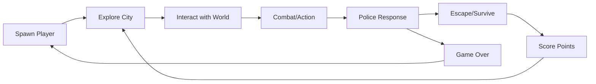
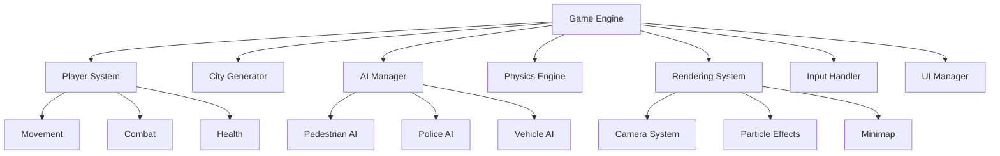
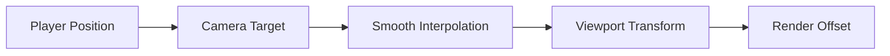
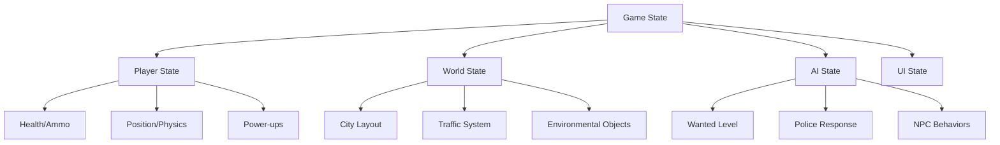
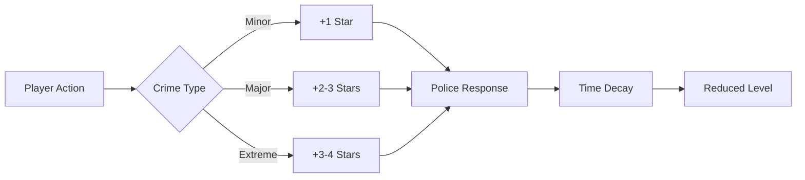

# GTA 2 Inspired JavaScript Arcade Game Design

## Overview

A browser-based, top-down arcade action game inspired by Grand Theft Auto 2, built entirely in JavaScript using HTML5 Canvas. The game features an open-world city environment with realistic physics, AI-driven NPCs, and classic GTA-style gameplay mechanics in a modern web implementation.

### Core Game Loop


## Technology Stack & Dependencies

### Frontend Technologies
- **HTML5 Canvas**: 2D rendering engine
- **JavaScript ES6+**: Game logic and systems
- **CSS3**: UI styling and layout
- **Web Audio API**: Sound effects (planned)

### Core Dependencies
- Vanilla JavaScript (no external libraries)
- Modern browser with HTML5 Canvas support
- 60 FPS performance target

### Browser Compatibility
- Chrome 60+
- Firefox 55+
- Safari 12+
- Edge 79+

## Component Architecture

### Component Definition

The game follows a modular component-based architecture with clear separation of concerns:



### Component Hierarchy

#### Core Engine Components
1. **Game Class** (`game.js`)
   - Central game loop and state management
   - Entity spawning and lifecycle
   - Performance monitoring

2. **Player Class** (`player.js`)
   - Vehicle physics and movement
   - Weapon system integration
   - Power-up management

3. **City Class** (`city.js`)
   - Procedural city generation
   - Building and road systems
   - Environmental decorations

#### AI System Components
1. **Pedestrian Class** (`pedestrians.js`)
   - Behavioral state machine
   - Panic and crowd dynamics
   - Collision avoidance

2. **Police Class** (`police.js`)
   - Wanted level response system
   - Line-of-sight detection
   - Pursuit behaviors

3. **Vehicle Class** (`vehicles.js`)
   - Traffic simulation
   - Pathfinding algorithms
   - Collision responses

#### Combat & Effects Components
1. **Weapon Class** (`weapons.js`)
   - Multiple weapon types
   - Ballistics simulation
   - Ammunition management

2. **Bullet Class** (`weapons.js`)
   - Projectile physics
   - Collision detection
   - Damage calculation

3. **Particle System** (`weapons.js`)
   - Visual effects rendering
   - Performance optimized particles
   - Multiple effect types

### Props/State Management

#### Game State Structure
```javascript
Game {
  // Core state
  isRunning: boolean
  deltaTime: number
  camera: { x, y, zoom }
  
  // Game objects
  player: Player
  city: City
  pedestrians: Array<Pedestrian>
  police: Array<Police>
  vehicles: Array<Vehicle>
  bullets: Array<Bullet>
  particles: Array<Particle>
  
  // Game statistics
  score: number
  wantedLevel: number (0-6)
  wantedTimer: number
}
```

#### Player State Management
```javascript
Player {
  // Physics
  x, y: position
  velocity: { x, y }
  angle: rotation
  speed: current speed
  
  // Combat
  weapon: Weapon
  health: number
  
  // Power-ups
  activePowerUps: Map<string, PowerUp>
  invincible: boolean
}
```

### Lifecycle Methods/Hooks

#### Game Loop Lifecycle
1. **Initialization** (`init()`)
   - Canvas setup and context creation
   - Entity spawning and world generation
   - Event listener registration

2. **Update Cycle** (`update(deltaTime)`)
   - Physics calculations
   - AI behavioral updates
   - Collision detection
   - State management

3. **Render Cycle** (`render()`)
   - Camera transformation
   - Entity rendering with culling
   - UI and effects overlay

4. **Cleanup** (`destroy()`)
   - Memory management
   - Event listener removal
   - Resource deallocation

### Example Component Usage

```javascript
// Game initialization
const game = new Game();
game.init();

// Player creation with physics
const player = new Player(game, x, y);
player.weapon = new Weapon('pistol', game);

// AI entity spawning
const pedestrian = new Pedestrian(game, x, y);
pedestrian.setBehavior('walking');

// Dynamic city generation
const city = new City(game);
city.generateDistrict('residential');
```

## Routing & Navigation

### Camera System
The game uses a dynamic camera system that follows the player:



#### Camera Features
- **Follow Target**: Smooth tracking of player movement
- **Zoom Control**: Dynamic zoom levels for different gameplay situations
- **Boundary Constraints**: Keeps camera within city bounds
- **Performance Optimization**: Viewport culling for off-screen entities

### World Navigation
```javascript
// Camera positioning system
camera: {
  x: playerX - screenWidth / 2,
  y: playerY - screenHeight / 2,
  zoom: 1.0,
  smoothing: 0.1
}
```

## Styling Strategy

### Visual Design System

#### Color Palette
- **Player Vehicle**: `#00ff00` (Bright Green)
- **Police Vehicles**: `#0066ff` (Blue) with `#ff0000` (Red) flashers
- **Pedestrians**: Various colors (`#ff6666`, `#66ff66`, `#6666ff`)
- **Buildings**: Grayscale palette (`#444`, `#555`, `#666`, `#777`)
- **Roads**: `#444` with `#fff` lane markings
- **UI Elements**: High contrast colors for readability

#### Visual Effects
```javascript
// Particle system styling
const explosionColors = ['#ff0000', '#ff6600', '#ffff00'];
const muzzleFlashColor = 'rgba(255, 255, 0, 0.8)';
const bloodParticleColor = '#8B0000';
```

#### Responsive Design
- Fixed 800x600 canvas with scaling
- Adaptive UI elements for different screen sizes
- Fullscreen support with F11 toggle

### Animation System
- **Smooth Movement**: 60 FPS interpolated movement
- **Particle Effects**: Dynamic particle systems for impacts
- **Visual Feedback**: Screen shake, flashing effects
- **Tire Marks**: Procedural skid mark generation

## State Management

### Centralized Game State
The game uses a centralized state management pattern:



### State Persistence
- **Local State**: Game session data (score, health, position)
- **Configuration**: User preferences (controls, settings)
- **Performance Metrics**: FPS monitoring and optimization data

### Event-Driven Updates
```javascript
// State update pipeline
update(deltaTime) {
  this.updatePhysics(deltaTime);
  this.updateAI(deltaTime);
  this.updateCombat(deltaTime);
  this.updateUI();
}
```

## API Integration Layer

### Internal API Structure

#### Game Engine APIs
```javascript
// Core game APIs
Game.prototype = {
  addBullet(bullet),
  addParticle(particle),
  spawnPedestrian(),
  spawnPolice(),
  increaseWantedLevel(amount),
  checkCollision(obj1, obj2)
}
```

#### Weapon System API
```javascript
// Weapon management
Weapon.prototype = {
  fire(x, y, angle),
  reload(),
  switchWeapon(type),
  getAmmoCount(),
  getDamage()
}
```

#### AI Behavior API
```javascript
// AI state management
NPCEntity.prototype = {
  setBehavior(state),
  findPath(target),
  detectPlayer(),
  respondToThreat(),
  updateBehavior(deltaTime)
}
```

### Performance APIs
- **Frame Rate Monitoring**: Real-time FPS tracking
- **Memory Management**: Garbage collection optimization
- **Error Handling**: Comprehensive error reporting system

## Testing Strategy

### Unit Testing Framework
Currently implements manual testing with debug capabilities:

#### Debug Console Features
- **F12**: Toggle debug console
- **F1-F5**: Debug commands (health, wanted level, spawning)
- **Performance Monitoring**: FPS display and bottleneck detection
- **Error Logging**: Comprehensive error tracking system

### Testing Categories

#### Core Gameplay Testing
```javascript
// Debug commands for testing
debugCommands = {
  'F1': 'Show help',
  'F2': 'Add player health',
  'F3': 'Increase wanted level',
  'F4': 'Spawn police',
  'F5': 'Spawn vehicle'
}
```

#### Performance Testing
- **Frame Rate**: Target 60 FPS maintenance
- **Memory Usage**: Entity cleanup and optimization
- **Collision Detection**: Spatial partitioning efficiency
- **Rendering**: Canvas drawing optimization

#### AI Behavior Testing
- **Pathfinding**: Navigation accuracy and performance
- **State Transitions**: Behavioral consistency
- **Response Systems**: Police and pedestrian reactions
- **Crowd Dynamics**: Large group AI performance

### Error Handling Strategy
```javascript
// Comprehensive error handling
window.errorHandler = {
  handleError(type, context),
  handleGameError(type, context),
  showErrorMessage(message),
  attemptRecovery()
}
```

## Core Game Systems

### Physics Engine
- **Vehicle Dynamics**: Realistic car physics with friction and momentum
- **Collision Detection**: Optimized spatial partitioning
- **Ballistics**: Projectile physics with gravity and air resistance
- **Particle Systems**: Efficient particle management

### Wanted Level System


### AI Behavioral States
1. **Pedestrians**: Walking → Panicking → Running → Recovery
2. **Police**: Patrolling → Investigating → Pursuing → Attacking
3. **Vehicles**: Driving → Stopped → Avoiding → Fleeing

### Weapon System
Multiple weapon types with distinct characteristics:
- **Pistol**: Balanced damage and rate of fire
- **Shotgun**: High damage, spread pattern
- **Uzi**: High rate of fire, lower damage
- **Rifle**: Long range, high accuracy
- **Rocket Launcher**: Explosive damage, area effect

### Power-up System
Dynamic power-up effects:
- **Speed Boost**: Increased movement speed
- **Rapid Fire**: Reduced weapon cooldown
- **Multi-Shot**: Multiple projectiles per shot
- **Invincibility**: Temporary damage immunity
- **Explosive Ammo**: All bullets become explosive

This design provides a comprehensive framework for a fully interactive GTA 2 inspired arcade game with modern web technologies, sophisticated AI systems, and engaging gameplay mechanics.