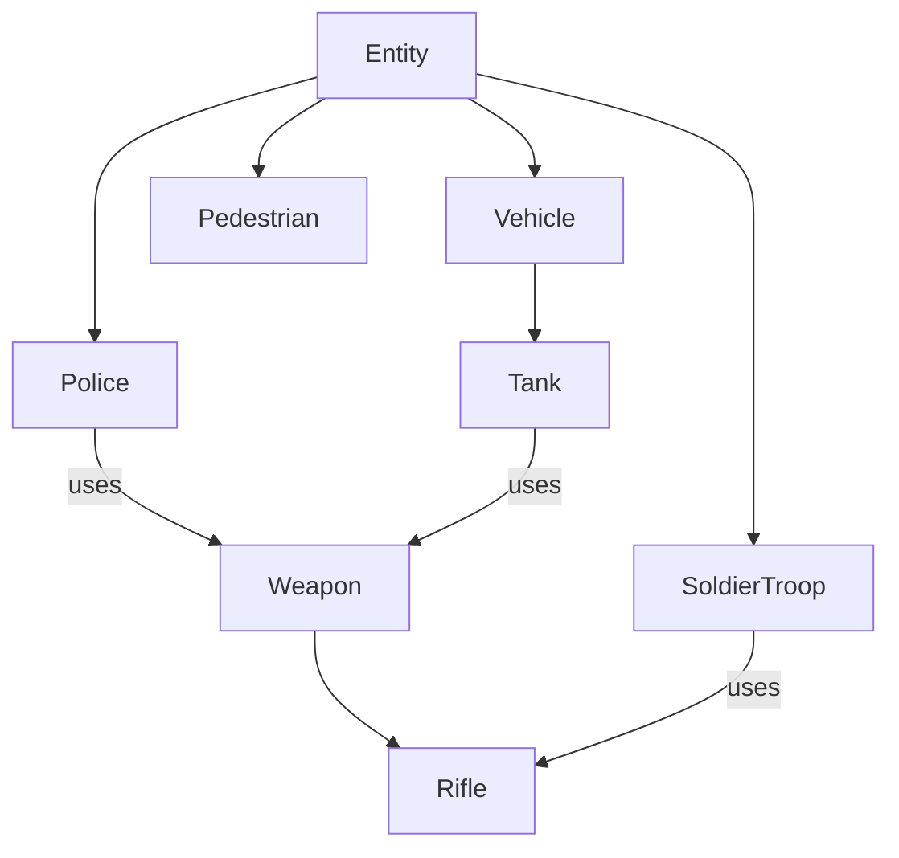
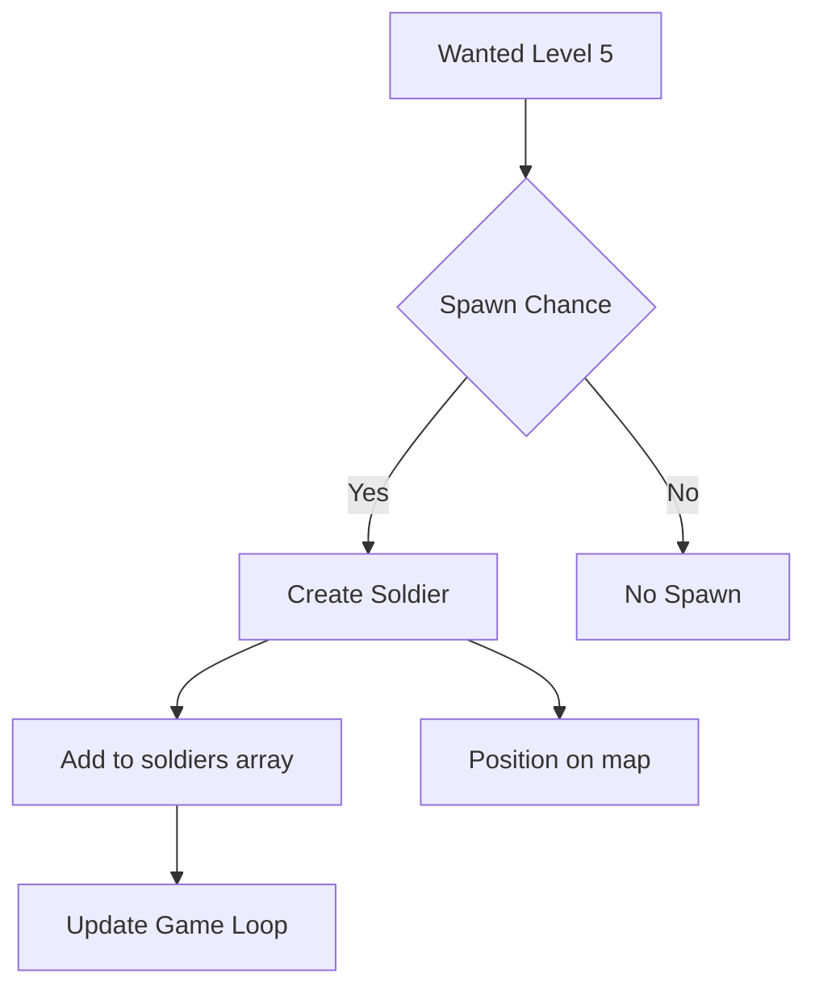

# Soldier Troop Class Design Document

## 1. Overview

The Soldier Troop class is a new human enemy type that will be introduced to the game as a high-level threat. These soldiers will spawn when the player reaches wanted level 5 and will march toward the player while shooting a rifle. This design document outlines the implementation plan for this new enemy class.

## 2. Requirements

- Spawn at wanted level 5
- March toward the player
- Shoot a rifle at the player
- Have appropriate health and damage values
- Be visually distinct from other enemies
- Integrate with the existing enemy management system
- Use the existing weapon system for rifle mechanics
- Implement proper collision detection
- Follow the existing enemy class patterns (similar to Police and Tank classes)

### 2.1 Enemy Comparison

| Enemy Type | Health | Damage | Speed | Weapon | Range |
|------------|--------|--------|-------|--------|-------|
| Pedestrian | 30 | N/A | 0.5-1.5 | None | N/A |
| Police | 50 | 15 | 1.5 | Pistol | 150 |
| Tank | 300 | 120 (primary) | 0.8 | Cannon/MG | 500 |
| Soldier | 100 | 40 | 1.0 | Rifle | 300 |

## 3. Class Design

### 3.1 Class Structure

```javascript
class SoldierTroop {
    constructor(game, x, y) {
        // Properties
        this.game = game;
        this.x = x;
        this.y = y;
        this.width = 12;
        this.height = 12;
        this.radius = 8;
        this.health = 100;
        this.maxHealth = 100;
        
        // Movement
        this.speed = 1.0;
        this.angle = 0;
        this.targetX = x;
        this.targetY = y;
        
        // Combat
        this.lastShot = 0;
        this.shootCooldown = 800; // ms
        this.weaponRange = 250;
        
        // Visual properties
        this.color = '#8B4513'; // Military brown
        this.uniformColor = '#4169E1'; // Royal blue for uniform
        
        // Weapon system
        this.weapon = new Weapon('rifle', game);
    }
}
```

### 3.2 Class Hierarchy



### 3.2 Key Methods

#### update(deltaTime)
Updates the soldier's position and behavior each frame:
- Move toward the player
- Shoot at the player when in range
- Check for collisions
- Update weapon state

#### render(ctx, lodLevel)
Renders the soldier with appropriate level of detail:
- High detail: Full soldier with uniform and rifle
- Medium detail: Simplified soldier shape
- Low detail: Basic colored rectangle

#### takeDamage(amount, fromAngle)
Handles damage taken by the soldier:
- Reduce health
- Handle death
- Create visual effects
- Create blood splatter effects (similar to Pedestrian class)

#### shootAtPlayer()
Handles the soldier's shooting behavior:
- Check if player is in range
- Use weapon system to fire rifle
- Apply cooldown

#### canSeePlayer()
Determines if the soldier has a clear line of sight to the player:
- Check distance to player
- Check for building obstructions (similar to Police class)

## 4. Integration Points

### 4.1 Game Spawning System
The soldier troops will be spawned through the game's existing enemy spawning system when the wanted level reaches 5. They will be added to a new `soldiers` array in the game object.

Spawning logic:
- Spawn soldiers with a probability based on wanted level 5 parameters
- Limit maximum soldiers on screen to 5
- Spawn at strategic positions (similar to police roadblocks)
- Use the same spawning methods as tanks (roadblock method preferred)



### 4.6 Game Loop Integration

The SoldierTroop class will integrate with the main game loop:

1. **Update Loop**: Soldiers will be updated in the main game loop similar to other entities
2. **Render Loop**: Soldiers will be rendered with appropriate LOD levels
3. **Collision System**: Soldiers will be added to the spatial grid for efficient collision detection
4. **Cleanup**: Dead soldiers will be removed from the game array each frame

### 4.2 Weapon System
The soldier will use the existing weapon system with rifle configuration from weapons.js:
- Damage: 40
- Range: 300
- Fire rate: 600ms
- Accuracy: 0.95
- Bullet speed: 12
- Color: #0066ff

### 4.3 Collision System
The soldier will integrate with the existing collision system for:
- Bullet collisions
- Player collisions
- Building collisions

### 4.4 Audio System
The soldier will integrate with the existing audio system for:
- Rifle shot sounds
- Death sounds
- Footstep sounds (optional)

### 4.5 Progression System
The soldier will integrate with the existing progression system for:
- Recording kills for statistics
- Unlocking achievements
- Difficulty progression tracking

### 4.5 Particle System
The soldier will integrate with the existing particle system for:
- Muzzle flash effects
- Blood splatter effects
- Death effects

## 5. Visual Design

### 5.1 Appearance
- Military brown color for skin
- Royal blue uniform
- Rifle weapon
- Helmet
- Gas mask (optional)

### 5.2 Animations
- Marching animation
- Shooting animation
- Death animation

### 5.3 Level of Detail (LOD)
- High: Full soldier with uniform details, rifle, and animations
- Medium: Simplified soldier shape with basic uniform
- Low: Colored rectangle with minimal details

## 6. Behavior Design

### 6.1 Movement
- Directly march toward the player
- Maintain formation when multiple soldiers are present
- Avoid obstacles when possible
- Use pathfinding similar to other enemy classes

### 6.2 Combat
- Shoot at player when in range
- Aim with high accuracy
- Reload when necessary
- Use cover when available (optional advanced feature)

### 6.3 AI States
- Patrolling (when player is not visible)
- Chasing (when player is visible)
- Attacking (when in weapon range)

## 7. Implementation Plan

### 7.1 Phase 1: Basic Class Implementation
1. Create SoldierTroop class in js/entities/SoldierTroop.js
2. Implement constructor with basic properties
3. Implement update and render methods
4. Add basic movement toward player
5. Add to game object arrays
6. Export class using window.SoldierTroop = SoldierTroop pattern (following project standards)

### 7.2 Phase 2: Combat System
1. Implement shooting mechanics
2. Integrate with weapon system
3. Add damage handling
4. Create visual effects
5. Implement canSeePlayer() method

### 7.3 Phase 3: Integration
1. Add soldier spawning to game system
2. Integrate with wanted level system (spawn at level 5)
3. Add to collision detection
4. Add to spatial grid system
5. Add to game update loop (updateSoldiers method)
6. Add to game render loop (renderSoldiers method)
7. Test with existing game systems
8. Balance health, damage, and spawn rates

## 8. Performance Considerations

- Use object pooling for bullets and particles
- Implement Level of Detail (LOD) rendering
- Limit maximum number of soldiers on screen (recommended max: 5)
- Optimize pathfinding algorithms
- Use spatial grid for collision detection
- Implement viewport culling for rendering
- Use efficient line-of-sight calculations
- Implement proper memory management for soldier objects
- Use efficient rendering techniques (skip off-screen soldiers)

## 9. Testing Plan

### 9.1 Unit Tests
- Test soldier movement
- Test shooting mechanics
- Test damage handling
- Test collision detection
- Test line-of-sight calculations
- Test weapon integration

### 9.2 Integration Tests
- Test spawning at wanted level 5
- Test interaction with player
- Test interaction with other enemies
- Test performance with multiple soldiers
- Test audio integration
- Test particle effects
- Test LOD rendering

### 9.3 Balance Testing
- Test soldier health and damage values
- Test spawn rates and maximum counts
- Test difficulty progression
- Test player counter-strategies