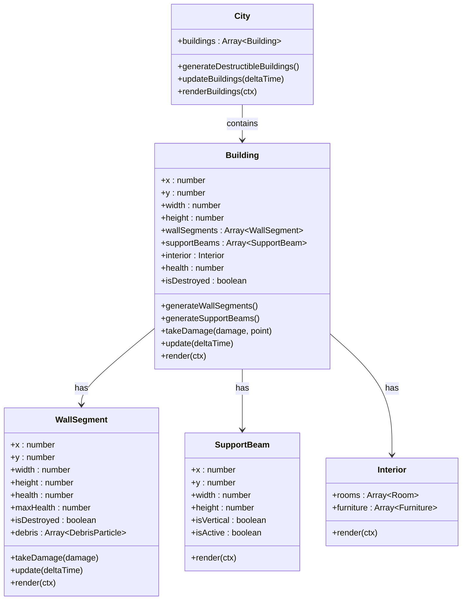
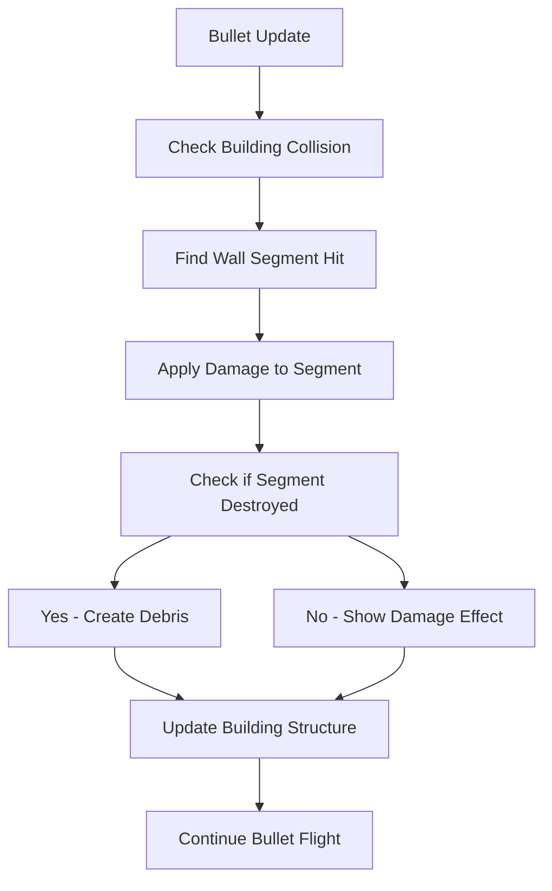

# Top-Down Building Structure Design

## Overview

This document outlines the design for destructible buildings with invincible support beams in the GTA-inspired game. The system will allow players to destroy building walls while maintaining structural integrity through invincible support beams, creating a realistic destruction effect while preserving gameplay balance.

## Architecture

The building destruction system will be implemented as an extension to the existing City class, with new Building and WallSegment classes to handle destructible elements. The system will integrate with the existing bullet collision detection and damage system.



## Building Structure Components

### Wall Segments
Wall segments represent destructible portions of building walls:
- Each building wall is divided into multiple wall segments
- Segments have individual health values
- When health reaches zero, the segment is marked as destroyed
- Destroyed segments create debris particles
- Segments can be partially damaged, showing visual cracks

### Support Beams
Support beams provide structural integrity to buildings:
- Positioned at regular intervals throughout the building
- Invincible to all damage types
- Rendered visually as steel beams
- Prevent complete building collapse
- Can be horizontal or vertical

### Interior System
Buildings have interior details visible through destroyed walls:
- Rooms with different functions (offices, apartments, storage)
- Furniture and fixtures (desks, chairs, beds)
- Interior lighting that activates when walls are destroyed
- Electrical systems that spark when damaged

## Data Models

### Building Model
```javascript
{
  x: number,              // Position X
  y: number,              // Position Y
  width: number,          // Building width
  height: number,         // Building height
  wallSegments: Array,    // Destructible wall segments
  supportBeams: Array,    // Invincible support beams
  interior: Object,       // Interior details
  health: number,         // Overall building health
  maxHealth: number,      // Maximum health
  isDestroyed: boolean,   // Complete destruction state
  destructionLevel: number // 0-1 scale of destruction
}
```

### Wall Segment Model
```javascript
{
  x: number,              // Position X
  y: number,              // Position Y
  width: number,          // Segment width
  height: number,         // Segment height
  health: number,         // Current health
  maxHealth: number,      // Maximum health (typically 100)
  isDestroyed: boolean,   // Destruction state
  damageLevel: number,    // 0-3 scale of damage (0=undamaged, 3=destroyed)
  debris: Array,          // Active debris particles
  lastHitTime: number     // Timestamp of last damage
}
```

### Support Beam Model
```javascript
{
  x: number,              // Position X
  y: number,              // Position Y
  width: number,          // Beam width
  height: number,         // Beam height
  isVertical: boolean,    // Orientation
  isActive: boolean,      // Whether beam is currently supporting structure
  health: number          // Infinite (represented as -1)
}
```

## Destruction Mechanics

### Damage System
1. **Bullet Impact**:
   - Bullets collide with building walls
   - Damage is applied to the specific wall segment hit
   - Damage amount depends on weapon type
   - Support beams are immune to damage

2. **Damage Distribution**:
   - Direct hit damage to wall segment
   - Adjacent segments receive reduced splash damage
   - Support beams absorb and redirect forces

3. **Destruction Effects**:
   - Visual cracks appear on damaged segments
   - Debris particles spawn from destroyed segments
   - Sound effects for different damage levels
   - Camera shake for heavy damage

### Structural Integrity
1. **Support System**:
   - Support beams maintain building structure
   - When wall segments are destroyed, beams become visible
   - Beams prevent total building collapse
   - Building remains standing with minimum beam structure

2. **Collapse Conditions**:
   - Building collapses when critical support beams are removed
   - Collapse triggers large-scale destruction effects
   - Nearby entities take damage from collapse
   - Debris field created around collapsed building

## Integration Points

### Bullet Collision System


### Visual Effects System
1. **Damage Visualization**:
   - Cracks appear on damaged wall segments
   - Color changes indicate damage levels
   - Partial transparency for destroyed segments

2. **Debris System**:
   - Particle effects for concrete and brick debris
   - Physics-based debris movement
   - Debris collision with ground and other objects

3. **Interior Reveal**:
   - Interior becomes visible through destroyed walls
   - Dynamic lighting inside buildings
   - Furniture and room details

## Performance Considerations

1. **Object Pooling**:
   - Reuse debris particles to reduce garbage collection
   - Pool wall segment objects for building regeneration
   - Efficient memory management for large numbers of buildings

2. **Level of Detail**:
   - Simplified destruction for distant buildings
   - Reduced particle effects based on camera distance
   - Culling of non-visible building interiors

3. **Spatial Partitioning**:
   - Only update and render buildings in viewport
   - Optimize collision detection with spatial grids
   - Batch rendering of similar building components

## Testing Strategy

### Unit Tests
1. **Wall Segment Damage**:
   - Verify damage application to correct segments
   - Test health reduction and destruction state
   - Validate debris particle creation

2. **Support Beam Immunity**:
   - Confirm beams cannot be damaged
   - Test structural integrity preservation
   - Validate beam visualization

3. **Building Integrity**:
   - Test collapse conditions
   - Verify partial destruction effects
   - Check interior reveal mechanics

### Integration Tests
1. **Bullet Collision**:
   - Test accurate segment hit detection
   - Verify damage transfer from bullets
   - Confirm support beam protection

2. **Visual Effects**:
   - Test damage visualization
   - Verify debris particle behavior
   - Confirm interior rendering

3. **Performance**:
   - Measure frame rate with multiple destroyed buildings
   - Test memory usage during destruction sequences
   - Validate level of detail implementation